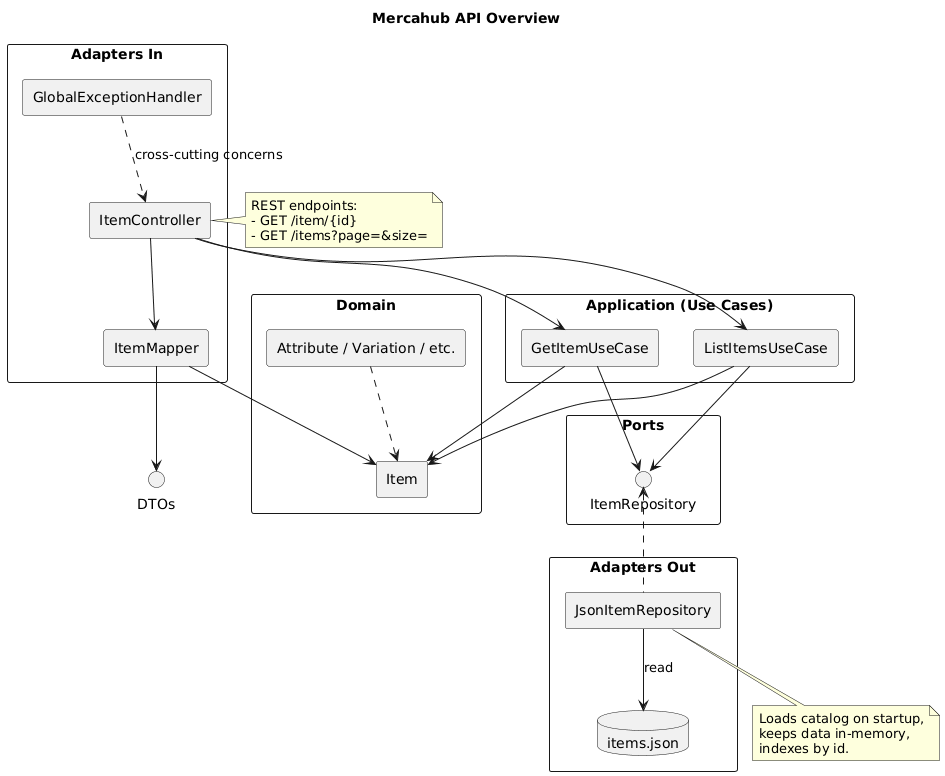

# Mercahub API

Mercahub é uma API inspirada no Mercado Livre que expõe catálogos de itens a partir de um repositório JSON. O projeto segue uma arquitetura hexagonal simples, separando regras de negócio (casos de uso), portas (interfaces) e adaptadores de entrada/saída.

## Visão Geral

- **Linguagem:** Java 21
- **Framework:** Spring Boot 3.4.3 (Web, Validation)
- **Documentação:** SpringDoc OpenAPI 2.6.0 (Swagger UI)
- **Build:** Maven (wrapper incluído)
- **Arquitetura:** Hexagonal (ports & adapters)
- **Persistência:** Arquivo `items.json` carregado em memória

### Camadas Principais

- `com.mercahub.domain`: modelos de domínio.
- `com.mercahub.application`: casos de uso (`GetItemUseCase`, `ListItemsUseCase`).
- `com.mercahub.ports`: contratos que expõem operações necessárias aos casos de uso.
- `com.mercahub.adapters.in.web`: controlador REST, mapeadores, tratamento de erros.
- `com.mercahub.adapters.out.json`: repositório que lê o catálogo de `items.json`.

## Requisitos

- JDK 21+
- Maven 3.9+ (facultativo – o wrapper `./mvnw` cobre)
- Docker (opcional, para executar via Compose)

## Como Executar

### Localmente (Maven)

```bash
./mvnw spring-boot:run
```

O serviço sobe em `http://localhost:8080`.

### Docker Compose (ambiente dev)

```bash
docker compose -f automation/docker-compose.dev.yml up --build
```

A aplicação será exposta em `http://localhost:8080`. O código da pasta do projeto é montado dentro do container, facilitando hot reload enquanto desenvolve.

## Endpoints

| Método | Rota          | Descrição                                    |
|--------|---------------|----------------------------------------------|
| GET    | `/item/{id}`  | Recupera um item específico pelo identificador. |
| GET    | `/items`      | Lista itens paginados (`page`, `size`).         |

### Exemplos

```
GET /item/MLB5722813046
```

```
GET /items?page=0&size=10
```

## Documentação OpenAPI (Swagger)

- Swagger UI: `http://localhost:8080/swagger-ui/index.html`
- Esquema JSON: `http://localhost:8080/v3/api-docs`

Quando a aplicação estiver em execução, acesse o Swagger UI para explorar e testar os endpoints interativamente. O schema expõe dois modelos principais:

- `ItemDto`: representação completa do item.
- `ItemSummary`: usado na listagem e contém apenas `id`, `title`, `category`, `price`.

## Testes

```bash
./mvnw test
```

> Se estiver usando Docker, garanta que o container tem o JDK instalado ou execute os testes na máquina host.

## Gerar Código OpenAPI

```bash
./mvnw clean compile
```

O plugin `openapi-generator-maven-plugin` roda na fase `generate-sources`, produzindo os DTOs e APIs em `target/generated-sources/openapi`.

## Próximos Passos / Ideias

- Persistir itens em banco real (em vez do JSON estático).
- Adicionar filtros de busca e ordenação na listagem.
 
## Diagrama

O diagrama abaixo resume o fluxo principal da API. O arquivo PlantUML foi renderizado em PNG está em `docs/architecture.png`.


